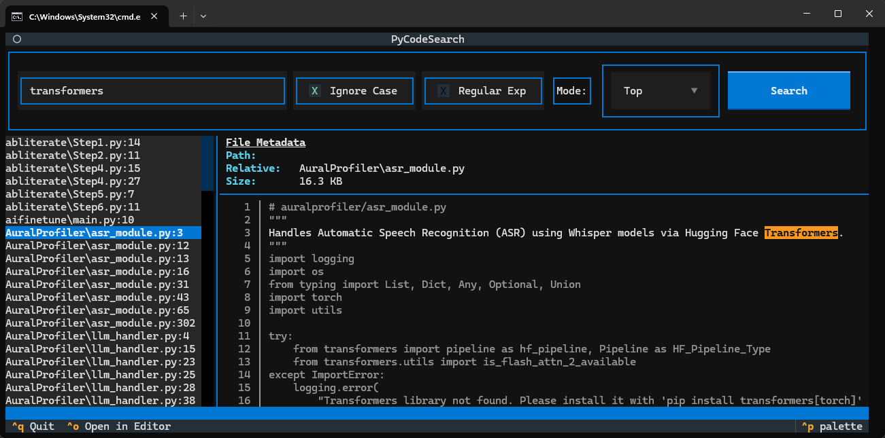

# Code Search

  

I have traditionally relied on PowerGREP, Notepad++ or other editor search functionality to search across projects. It always took too long and the results were not actionable. I needed a way to *quickly* search across my projects and then open an editor.  **PyCodeSearch** is a high-performance source code search utility that operates via Command Line Interface (CLI) or an interactive Textual TUI. Given that Python is my primary language, I wanted to be able to search at a specifiable level of all my projects (application, user module, or everything) so it supports literal and regex matching across configurable directory trees with multiple search scopes to control traversal depth and exclusions.

This is an AI-assisted coded application, not vibe coded. This was a weekend project so I wanted to throw something together quickly without investing a lot of time.



Since the program uses the textual library, the user interface expands beautifully as the size of the console is changed. Your mouse also works as expected on all the controls. If you double-click a file in the hit-list, notepad++ will open the file to the line the hit occurs. This makes searching for and fixing breaking changes across projects very easy.

## ✨ Features

*   **Dual Interface:** Use the CLI for quick searches and scripts, or launch the interactive TUI for browsing results with context.
*   **Intelligent Search Modes:**
    *   `Top`: Search only files in immediate subdirectories.
    *   `User`: Recursive search excluding noise directories (e.g., `.venv`, `.git`, `node_modules`).
    *   `All`: Recursive search with no exclusions.
*   **Performance Optimized:** Uses a tiered binary pre-filter strategy to skip files that do not contain the search term, avoiding expensive text decoding and line number determination.
*   **Rich Output:** Syntax-highlighted matches and context lines in both TUI and CLI modes.
*   **Editor Integration:** Double-click hits or press `Ctrl+O` to jump directly to the line in Notepad++.
*   **Programmatic API:** Returns structured metadata objects (`SearchResult`, `FileResult`, `LineMatch`) for use in other Python applications.

## 📦 Installation

1.  Ensure you have Python 3.10 or higher installed.
2.  Install the required dependencies:

```bash
pip install rich textual
```

3.  Download the `pycodesearch.py` script or clone this repository.

## 🚀 Usage

### Command Line Interface (CLI)

Search for a literal string:
```bash
python pycodesearch.py "search_term" --path /path/to/projects
```

Search using a regular expression (case-insensitive):
```bash
python pycodesearch.py "import os" -p /projects -m user --regex --ignore-case
```

### Textual TUI

Launch the interactive interface by adding the `--tui` flag:
```bash
python pycodesearch.py "def process" --path K:\\PycharmProjects --tui
```

**TUI Keybindings:**
*   `Enter`: Execute search.
*   `Ctrl+O`: Open highlighted file in editor.
*   `Ctrl+Q`: Quit application.
*   `Double-Click`: Open specific hit in editor.

<details>
<summary>📖 TUI Layout Details</summary>

The TUI features a split-panel interface:
*   **Left Panel:** Scrollable list of hits (`filepath:line_number`).
*   **Top Right:** File metadata (Path, Size, Modified date, Encoding).
*   **Bottom Right:** Context view showing the matched line highlighted with surrounding code.

</details>

## ⚙️ Configuration

### CLI Arguments

| Argument        | Short | Description                                | Default                |
| :-------------- | :---- | :----------------------------------------- | :--------------------- |
| `search_value`  |       | The string or regex pattern to search for. | *Required*             |
| `--path`        | `-p`  | Root directory path to search under.       | *Required*             |
| `--mode`        | `-m`  | Search scope: `top`, `user`, or `all`.     | `top`                  |
| `--mask`        |       | Semicolon-delimited file glob patterns.    | `*.py;*.ts;*.tsx;*.js` |
| `--regex`       | `-r`  | Enable regex matching.                     | Literal match          |
| `--ignore-case` | `-i`  | Perform case-insensitive search.           | Case-sensitive         |
| `--tui`         | `-t`  | Launch the Textual TUI interface.          | `True`                 |

### Editor Integration

The TUI attempts to open files in **Notepad++**. It checks the `NOTEPADPP_PATH` environment variable first, then falls back to the default installation path (`C:\Program Files\Notepad++\notepad++.exe`).

To configure a custom path:
```bash
# Linux/macOS
export NOTEPADPP_PATH="/path/to/editor"

# Windows (Command Prompt)
set NOTEPADPP_PATH=C:\Tools\Editor\editor.exe
```

### Excluded Directories

When using `--mode user`, the following directories are automatically excluded from traversal:

`.venv`, `venv`, `__pycache__`, `.git`, `.idea`, `.vscode`, `node_modules`, `.tox`, `dist`, `build`, `.eggs`, `.mypy_cache`, `.pytest_cache`, `.ruff_cache`

You can override this list using the `--exclude` argument (comma-separated).

### Programmatic API

You can use the search engine directly in your Python code:

```python
from pycodesearch import SearchPythonCode, SearchMode, MatchType

# Initialize the searcher
searcher = SearchPythonCode(
    "K:\\PycharmProjects",
    mode=SearchMode.SEARCH_ALL_USER_PROJECT_LEVEL_CODE,
    file_mask="*.py;*.pyx",
    case_sensitive=False,
)

# Execute a search
result = searcher.search("process_data")

# Iterate through results
for file_result in result.file_results:
    print(f"Found in: {file_result.relative_path}")
    for line_match in file_result.line_matches:
        print(f"  Line {line_match.line_number}: {line_match.line_content.strip()}")
```

## 📄 License

Copyright (c) 2026 Stephen Genusa. All rights reserved.
Licensed under the [MIT License](https://opensource.org/licenses/MIT).